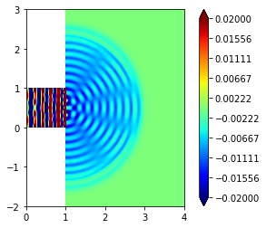

Wave equation in a slit domain
==============================

In the following we will consider the wave equation

.. raw:: latex

   \begin{align*}
     \partial_{tt}\psi - \Delta\psi &= 0, && \text{in } \Omega\times(0,T), \\
             \psi &= g, && \text{on } \Gamma_D\times(0,T), \\
        \nabla\psi\cdot n &= 0 && \text{on } \partial\Omega\setminus\Gamma_D,
   \end{align*}

where :math:`n` is the outward unit normal and :math:`g` is given
Dirichlet data given on part of the domain boundary. We repeat a double
slit experiment, i.e., we have a wave channel which ends in two slits on
the right and forcing the wave on the left end by defining
:math:`g=\frac{1}{10\pi}\cos(10\pi t)`.

We discretize the wave equation by an explicit symplectic time stepping
scheme for two unknowns :math:`\psi^n` and :math:`p^n` where
:math:`p=-\partial_t\psi` based on

.. raw:: latex

   \begin{align*}
     \partial_t \psi = -p, \\
     \partial_t p    = -\triangle\psi
   \end{align*}

The discretization first updates :math:`\psi` by half a time step then
updates :math:`p` and concludes by another update step for :math:`\psi`.
So given :math:`(\psi^n,p^n)` we compute

.. raw:: latex

   \begin{align*}
     \psi^{n+\frac{1}{2}} &= \psi^n - \frac{\Delta t}{2}p^n, \\
     p^{n+1}              &=
         \begin{cases}
              p^n - \triangle\psi^{n+\frac{1}{2}} & \text{in the interior}, \\
              g(t^{n+1}) & \text{on }\Gamma_D
         \end{cases} \\
     \psi^{n+1}           &= \psi^{n+\frac{1}{2}} - \frac{\Delta t}{2}p^{n+1}.
   \end{align*}

Note that the update for :math:`\psi` does not involve any spatial
derivatives so can be performed directly on the level of the degree of
freedom vectors. We use *numpy* for these steps. For the update of
:math:`p` we use a variational formulation

.. raw:: latex

   \begin{align*}
     \vec{p} &= \vec{p} + M^{-1}S\vec{\psi}
   \end{align*}

where :math:`S` is the stiffness matrix
:math:`S=(\int_\Omega\nabla\varphi_j\nabla\varphi_i)_{ij}` and :math:`M`
is the mass matrix, i.e., :math:`M=\int_\Omega\varphi_j\varphi_i)_{ij}`.
To simplify the computation we use a lumped version of this matrix,
i.e,, :math:`M\approx{\rm diag}(\int_\Omega\varphi_i)`. In this form the
algorithm only involves a matrix vector multiplication and no implicit
solving step is required.

.. code:: ipython3

    import matplotlib
    matplotlib.rc( 'image', cmap='jet' )
    import math
    import dune.fem as fem
    from dune.grid import reader
    from dune.alugrid import aluConformGrid as leafGridView
    from dune.fem.space import lagrange as solutionSpace
    from ufl import TrialFunction, TestFunction, grad, dot, dx
    from dune.ufl import Constant, BoxDirichletBC
    fem.parameter.append({"fem.verboserank":-1})
    T = 3
    dt = 0.005
    t = 0

We use *gmsh* to define the domain and then set up a first order scalar
Lagrange space which we will use both for :math:`\psi` and :math:`p`. We
can construct general grids by either defining the grids directly in
Python (as demonstrated in the following example) or by reading the grid
from files using readers provided by Dune, e.g., Dune Grid Format (dgf)
files or Gmsh files.

.. code:: ipython3

    domain = (reader.gmsh, "wave_tank.msh")
    gridView  = leafGridView( domain, dimgrid=2 )
    gridView.hierarchicalGrid.loadBalance()
    V = solutionSpace(gridView, order=1, storage="fem")
    
    p      = V.interpolate(0,name="p")
    phi    = V.interpolate(0,name="phi")
    pVec   = p.as_numpy
    phiVec = phi.as_numpy

Next we define an operator for the stiffness matrix including the
boundary condition which are time dependent so we use a ``Constant`` for
this. We use the ``BoxDirichletBC`` class which is derived from the more
general ``DirichletBC`` class which takes a function space, the boundary
function :math:`g` as a ufl expression, and finally a description of the
part :math:`\Gamma_D` of the boundary where this boundary condition is
defined. This can be a ufl expression which evaluates to :math:`0` for
:math:`x\not\in\Gamma_D`, e.g., an ufl ``conditional``.

Note that the stiffness matrix does not depend on time so we can
assemble the matrix once and extract the corresponding sscipy\* sparse
matrix.

.. code:: ipython3

    u    = TrialFunction(V)
    v    = TestFunction(V)
    p_in = Constant(0.0, name="g")
    # the following is equivalent to
    # x    = SpatialCoordinate(V)
    # bc   = DirichletBC(V, p_in, conditional(x[0]<1e-10,1,0))
    bc   = BoxDirichletBC(V, p_in, [None,None],[0,None], eps=1e-10)
    
    from dune.fem.operator import galerkin,linear
    op        = galerkin([dot(grad(u),grad(v))*dx,bc])
    S         = linear(op).as_numpy
    lapPhi    = V.interpolate(1,name="e")
    lapPhiVec = lapPhi.as_numpy

Next we multiply the inverse lumped mass matrix to :math:`S`, i.e., we
form the matrix :math:`\Delta t M^{-1}S` where :math:`M` is a diagonal
matrix with entries :math:`m_{ii} = \int_\Omega\varphi_i`. To compute
these values we construct the mass operator
:math:`<L[u],\varphi_i> = \int_\Omega u\varphi_i` and apply it to
:math:`u\equiv 1`

.. code:: ipython3

    from scipy.sparse import dia_matrix
    lumping = galerkin(u*v*dx)
    lumped = lapPhi.copy()
    lumping(lapPhi,lumped)       # note that lapPhi=1
    N = len(lumped.as_numpy)
    M = dia_matrix(([dt/lumped.as_numpy],[0]),shape=(N,N) )
    S = M*S

We can now set up the time loop and perform our explicit time stepping
algorithm. Note that the computation is carried out completely using
*numpy* and *scipy* algorithms we the exception of setting the boundary
conditions. This is done using the ``setConstraints`` method on the
stiffness operator which we constructed passing in the boundary
conditions. At the time of writing it is not yet possible to extract a
sparse matrix and vector encoding the boundary constraint.

.. code:: ipython3

    step = 0
    while t <= T:
        step += 1
        phiVec[:] -= pVec[:]*dt/2
        pVec[:]   += S*phiVec[:]
        t += dt
        # set the values on the Dirichlet boundary
        op.model.g = math.sin(2*math.pi*5*t)
        op.setConstraints(p)
        phiVec[:] -= pVec[:]*dt/2
    phi.plot(gridLines=None, clim=[-0.02,0.02])

